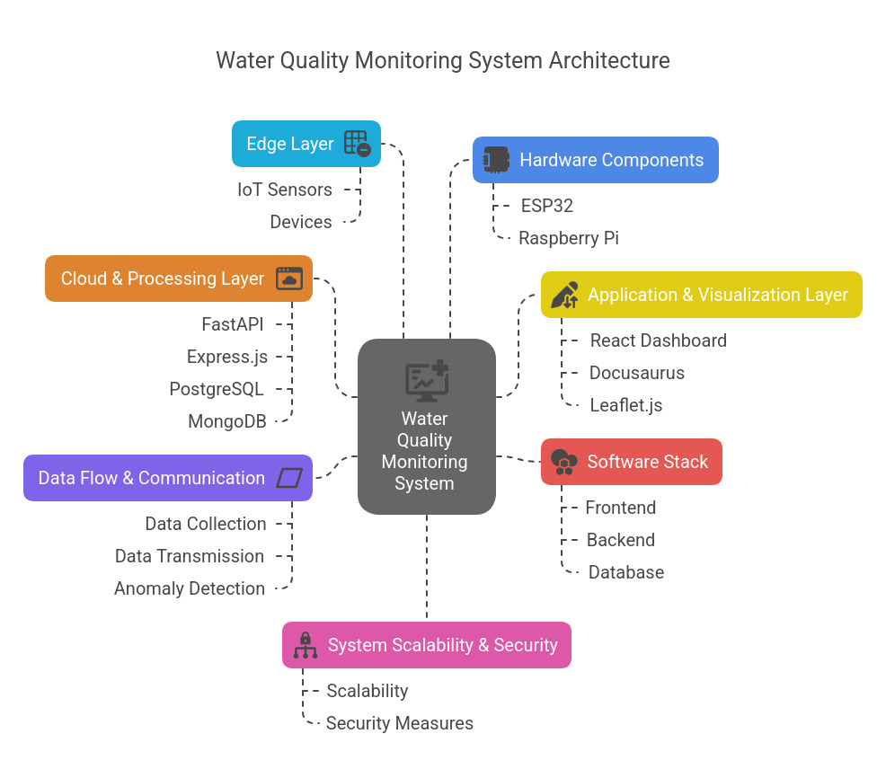

# **IoT-Based Distributed Lake Monitoring System**

## **Understanding the Architecture**

It is crucial to grasp how various components interact to achieve seamless data collection, processing, and visualization. It provides insights into the roles of IoT devices, communication protocols, backend services, and frontend interfaces, ensuring a holistic view of the system's functionality and scalability.
The **IoT-Based Distributed Lake Monitoring System** is designed to track water quality parameters in real time across multiple sensor nodes deployed in a lake. The system provides an **interactive dashboard**, **alerts for anomalies**, and **geospatial mapping** of sensor locations.

## **System Architecture**

The NammaLakes platform is structured into five distinct but interconnected layers, each serving specific functions within the ecosystem:

   #### 1. IoT Layer (Edge Devices)
   #### 2. Communication Layer
   #### 3. Backend Layer
   #### 4. Database Layer
   #### 5. Frontend Layer

### 1. IoT Layer (Edge Devices)
This layer consists of **ESP32 and Raspberry Pi** devices that collect real-time data from multiple sensors deployed across the lake.

#### **Devices & Sensors**
- **ESP32**: Used for low-power, low-cost sensor nodes  
- **Raspberry Pi**: Used for more computationally intensive tasks (e.g., local data processing)  
- **Sensors Used:**  
  -  **pH Sensor**: Measures water acidity  
  -  **Temperature Sensor**: Monitors temperature variations
---

### 2. Communication Layer

This intermediate layer enables reliable data transmission between edge devices and backend services.

#### Protocols and Infrastructure
- **MQTT Protocol:** Primary communication method providing low-latency, reliable telemetry transmission
- **MQTT Broker:** Mosquitto implementation for message queuing and distribution
- **HTTP REST APIs:** Secondary method for periodic updates and configuration changes
- **WebSockets:** Supporting bidirectional real-time communication for dashboard updates
---

### 3. Backend Layer
This layer is responsible for **data ingestion, processing, and API services**.

#### **Frameworks Used**
-  **FastAPI (Python)** Primary framework for RESTful API development, offering high performance and developer efficiency 

#### **Core Functionalities**
1. **Data Ingestion Pipeline:**

- MQTT subscription services for real-time data reception
- HTTP endpoints for batch uploads and configuration
- Data validation and normalization routines

2. **Processing Services:**

- Time-series analysis of water quality parameters
- Statistical modeling for baseline establishment
- Threshold monitoring for alerting systems

3. **API Services:**

- RESTful endpoints for dashboard and mobile applications
- WebSocket servers for real-time updates
- Data export capabilities for research and integration

---

### 4. Database Layer

#### **Primary Database: PostgreSQL**
Stores structured data like:
-  **Sensor metadata** (Device ID, location, calibration details)  
-  **Alert History** (Triggered alerts, timestamps, responses)  

---

### 5. Frontend Layer

User-facing interfaces providing visualization, configuration, and alerting capabilities.

#### **Technology Stack**
-  **React.js**: For UI development  
-  **Docusaurus**: For system documentation  

#### **Dashboard Features**

- **Interactive Dashboard:** Real-time visualization of sensor readings with customizable views using Recharts
- **Geospatial Mapping:** Leaflet.js implementation showing sensor node locations and status
- **Alert Management:** Configuration interface for threshold settings and notification preferences
- **Trend Analysis:** Historical data visualization with customizable date ranges
- **System Administration:** Node configuration and user management interfaces

---

## Deployment & Infrastructure
- **Docker**: Containerized backend and databases  
- **Cloud Hosting**: AWS (EC2, RDS, IoT Core)  
- **Load Balancing**: AWS ALB  
---

## **Workflow Summary**

The NammaLakes system follows a logical data flow sequence:

1. **Sensor Data Collection:** Edge devices gather readings from attached sensors
2. **Edge Processing:** Initial filtering and validation at the source
3. **Data Transmission:** MQTT/HTTP protocols transmit data to the backend
4. **Data Ingestion:** Backend services receive, validate, and normalize readings
5. **Storage:** Structured storage across PostgreSQL
6. **Processing & Analysis:** Statistical analysis and threshold monitoring
7. **Visualization:** Real-time dashboard updates via WebSockets
8. **Alerting:** Notification dispatch when parameters exceed thresholds sent via **emails, Whatsapp and Telegram bots.**

---
