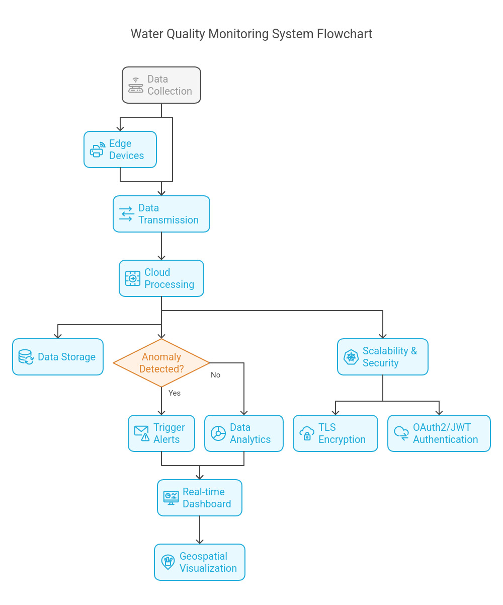

# **IoT-Based Distributed Lake Monitoring System**

## **Understanding the Architecture**

It is crucial to grasp how various components interact to achieve seamless data collection, processing, and visualization. It provides insights into the roles of IoT devices, communication protocols, backend services, and frontend interfaces, ensuring a holistic view of the system's functionality and scalability.
The **IoT-Based Distributed Lake Monitoring System** is designed to track water quality parameters in real time across multiple sensor nodes deployed in a lake. The system provides an **interactive dashboard**, **alerts for anomalies**, and **geospatial mapping** of sensor locations.

## **System Architecture**

### 1. IoT Layer (Edge Devices)
This layer consists of **ESP32 and Raspberry Pi** devices that collect real-time data from multiple sensors deployed across the lake.

#### **Devices & Sensors**
- **ESP32**: Used for low-power, low-cost sensor nodes  
- **Raspberry Pi**: Used for more computationally intensive tasks (e.g., local AI/ML processing)  
- **Sensors Used:**  
  -  **pH Sensor**: Measures water acidity  
  -  **Temperature Sensor**: Monitors temperature variations  
  -  **Turbidity Sensor**: Detects suspended particles  
  -  **Dissolved Oxygen Sensor**: Measures oxygen concentration  
  -  **Conductivity Sensor**: Determines dissolved salts and chemicals  

#### **Data Communication**
- **MQTT Protocol**: Ensures low-latency real-time telemetry  
- **HTTP REST API**: Used for periodic updates  
- **Edge Processing**: Filters noisy sensor data before transmission  

---

### 2. Communication Layer
- **MQTT Broker** (e.g., EMQX, Mosquitto) for real-time streaming  
- **WebSockets** for real-time dashboard updates  
- **Security Measures**:  
  -  **TLS/SSL encryption** for secure data transmission  
  -  **OAuth2/JWT authentication** for API access  

---

### 3. Backend Layer
This layer is responsible for **data ingestion, processing, and API services**.

#### **Frameworks Used**
-  **FastAPI (Python)** for RESTful API development  
-  **Express.js (Node.js)** as an alternative backend  

#### **Core Functionalities**
1. **Data Ingestion**: Accepts sensor data via **MQTT & HTTP**  
2. **Storage & Management**:  
   - **PostgreSQL** for structured data (sensor metadata, users, alerts)  
   - **MongoDB** for time-series sensor readings  
3. **Anomaly Detection**: Uses AI/ML to detect abnormal sensor readings  
4. **API Services**: REST API for frontend and WebSocket updates  

---

### 4. Database Layer
#### **Primary Database: PostgreSQL**
Stores structured data like:
-  **Sensor metadata** (Device ID, location, calibration details)  
-  **User Management** (Roles, permissions, authentication)  
-  **Alert History** (Triggered alerts, timestamps, responses)  

#### **Time-Series Database: MongoDB**
- Stores high-frequency sensor readings for **fast analytics**  

#### **Geospatial Data Handling: PostGIS**
- Enables mapping of sensor nodes for **real-time location tracking**  

---

### 5. Frontend Layer
#### **Technology Stack**
-  **React.js**: For UI development  
-  **Docusaurus**: For system documentation  

#### **Dashboard Features**
- ** Real-time Data Visualization** with Charts.js/Recharts  
- ** Alerts & Notifications** (Email, SMS, WebSockets)  
- ** Map Integration** (Leaflet.js, Google Maps API)  

---

### 6. Deployment & Infrastructure
- **Docker**: Containerized backend, frontend, and databases  
- **Cloud Hosting**:  
  - AWS (EC2, RDS, IoT Core)  
  - GCP (Compute Engine, Pub/Sub)  
- **Load Balancing**: Kubernetes, Nginx, AWS ALB  
- **CI/CD Pipelines**: GitHub Actions for automated deployment  

---

## **Workflow Summary**
1. **IoT Sensors** collect real-time water quality data via **MQTT/HTTP**  
2. **Edge devices (ESP32/Raspberry Pi)** preprocess and transmit data  
3. **Backend (FastAPI/Express)** processes and stores sensor data  
4. **Anomaly detection triggers alerts for abnormal conditions**  
5. **Frontend (React)** visualizes real-time data on dashboards  
6. **Users receive alerts via notifications (email, SMS, web)**  

---

## **Conclusion**
This system provides a **scalable and efficient lake monitoring solution** with real-time data collection, visualization, and anomaly detection.

---
