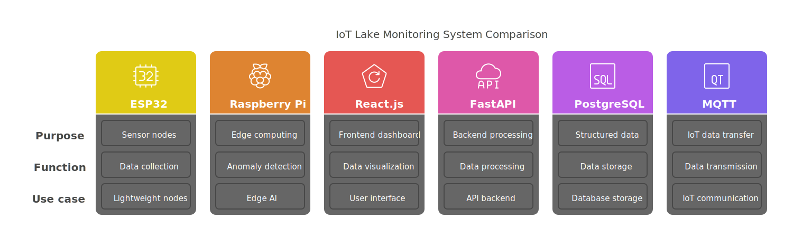

# **System Design: IoT-Based Lake Monitoring System**

##  Overview
The **IoT-Based Distributed Lake Monitoring System** is designed to **collect, process, and analyze** water quality parameters using **IoT sensors, cloud computing, and real-time analytics**. This section explains the **high-level architecture**, **hardware components**, **software stack**, and **data flow** in the system.

---

## **1. High-Level Architecture**
The system consists of **three major layers**:

1. **Edge Layer (IoT Sensors & Devices)**  
   - Collects real-time water quality data.
   - Uses **ESP32** and **Raspberry Pi** for data acquisition.
   - Transmits data via **MQTT** or **REST APIs**.

2. **Cloud & Processing Layer**  
   - Uses **FastAPI (Python)** for backend processing.
   - Stores structured data in **PostgreSQL**.
   - Performs **anomaly detection** and **data analytics**.

3. **Application & Visualization Layer**  
   - Provides a **React-based dashboard** for real-time monitoring.
   - Implements **Docusaurus** for system documentation.
   - Uses **Leaflet.js** for **geospatial visualization**.

---

## **2. Hardware Components**
###  IoT Devices
- **ESP32** – Low-power microcontroller for lightweight sensor nodes.
- **Raspberry Pi** – Used for edge computing and AI-based anomaly detection.

###  Water Quality Sensors
| Sensor | Parameter Measured |
|--------|-------------------|
| **pH Sensor** | Water acidity level |
| **Temperature Sensor** | Water temperature |
---

## **3. Software Stack**
| Component | Technology Used |
|-----------|----------------|
| **Frontend** | React.js + Recharts (Data Visualization) |
| **Backend** | FastAPI (Python)|
| **Database** | PostgreSQL (Structured Data)|
| **Messaging Protocol** | MQTT (IoT Data Transfer) |
| **Cloud Deployment** | Docker + AWS |

---

## **4. Data Flow & Communication**
1. **Sensor Nodes (ESP32/Raspberry Pi)** collect water quality data.  
2. **Data is transmitted** via **MQTT/REST API** to the backend.  
3. **Backend processes and stores** data in **PostgreSQL**.  
4. **Anomaly detection module** triggers alerts if abnormal values are detected.  
5. **Frontend Dashboard** updates in **real-time** via WebSockets.  
6. **Alerts & Notifications** are sent via **Email/SMS** if critical thresholds are breached.  

---

## **5. System Scalability & Security**
###  Scalability Considerations
- Supports **multiple sensor nodes** for **distributed monitoring**.
- Uses **Docker** for **scalable backend deployment**.
- Implements **load balancing (AWS ALB)** for handling high data influx.

---

##  Conclusion
The **IoT-Based Lake Monitoring System** integrates **IoT, cloud computing, and real-time analytics** to provide an efficient and scalable solution for water quality monitoring. This design ensures **high accuracy, automation, and ease of access** for stakeholders.

---
